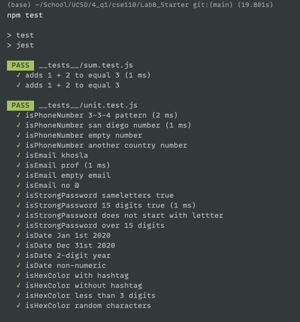

# Lab 8 - Starter
Done individually — Lucas Lee

Entire result of `npm test` can be viewed [here](https://app.warp.dev/block/dWue3SQlZHRkhfj05S5eBS)
Alternatively, there are screenshots below

1) Where would you fit your automated tests in your Recipe project developement pipeline? Select one of the following and explain why?
- Within a Github action that runs whenever code is pushed. This is because whenever we want push code onto our repo, we want to make sure that the changes made have at least some sort of quality. This is basically a sanity check to ensure that your changes are at least not screwing up some existing functionalities. 

2) Would you use an end to end test to chek if a funciton is returning the correct output?
- No. Checking the function of an output is more along the lines of unit testing.

3) Would you use a unit test to test the "message" feature of a messaging application? Why or why not? For this aquestion, assumt the "message" feature allows a user to write and send a message to another user.
- No, an UI/E2E is more appropriate. This is because this implies that there is an **input** from a user and then that input is outputted to another user's storage, wherever that may be. A unit test would be appropriate if the question specifies what smaller sub-unit of the message feature to test, such as ability to edit another user's database entry.However, the word 'feature' implies the testing of the whole process starting at user input, which is why unit test is not the most appropriate.  

4) Would you use a unit test to test the "max message length" feature of a messaging application? Why or why not? For this question, assume the "max message length" feature prevents the user from typing more than 80 characters.
- No, because the "max message length" is likely needed to be presented to the on the DOM due to the **input** from the user. A unit test would only be suitable if it was checking that if there is assert/input validation clause such that it cannot write a message > some length to the database. However, the word 'feature' implies the testing of the whole process starting at user input, which is why unit test is not the most appropriate. 